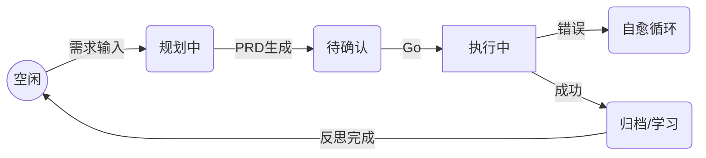

# 🌌 Antigravity Agent OS

[](docs/prd/evolution-engine.md)
[](https://github.com/your-username/antigravity-system-preview)
[](.agent/memory/project_decisions.md)

> **打破 AI 对话孤岛，赋予 Agent 持久记忆与自我进化能力。**  
> Antigravity 是一套面向 AI Native 开发的"前额叶"系统，将零散的对话转化为结构化的知识沉淀。

---

## ⚡ 核心能力 (Core Pillars)

### 🧠 持续进化 (Self-Evolution) - **NEW!**
*不再是每次清空缓存后的"新员工"*。Evolution Engine 模块让 Agent 能够：
- **知识提取**: 从对话中自动收割最佳实践并存入 `knowledge/` 库。
- **模式识别**: 识别跨功能的代码模板，自动生成 `pattern_library.md`。
- **效能优化**: 追踪 `workflow_metrics.md`，持续调优开发流水线的时间分配。
- **自我反思**: 任务完成后自动生成反思报告，总结 `What Went Well` 且制定落地计划。

### 💾 记忆中枢 (Memory Core)
*真正的长短期记忆融合*。通过 `.agent/memory/` 目录实现：
- **短期记忆**: `active_context.md` 实时记录任务栈与草稿，支持跨会话接力。
- **长期记忆**: `project_decisions.md` 固化架构决策与已知错误模式，杜绝同一个坑踩两次。
- **用户偏好**: `user_preferences.md` 让 Agent 深度理解你的代码审美。

### ⚙️ 自动化流水线 (Workflow Ops)
*极简指令，工程级交付*。
- **`/feature-flow`**: 从需求澄清、PRD 生成到代码实现的全自动闭环。
- **`/analyze-error`**: 手动或自动触发的报错根因分析与自愈。
- **`/start`**: 零触感启动协议，快速对齐上下文。

---

## 📂 目录结构 (Directory Archetype)

```bash
.agent/
├── memory/                     # 🧠 记忆系统
│   ├── evolution/              # 🧬 进化引擎数据 (Metrics, Patterns, Reflections)
│   ├── active_context.md       # [动态] 当前任务快照
│   ├── project_decisions.md    # [静态] 项目宪法 (架构决策)
│   └── knowledge/              # [沉淀] 结构化知识条目
├── rules/                      # 🚦 规则引擎 (Router & Gatekeepers)
│   └── router.rule             # 逻辑分发中枢
├── skills/                     # 🛠️ 技能模块 (Skill Sets)
│   ├── evolution-engine/       # 进化引擎核心
│   └── context-manager/        # 记忆读写管家
└── workflows/                  # 🧬 自动化流程 (Workflows)
    ├── evolve.md               # 进化/学习流程
    ├── reflect.md              # 自动反思流程
    └── feature-flow.md         # 交付交付流程
```

---

## 🛠️ 环境准备 (Prerequisites)

为了让 Antigravity 完整发挥其自动化与自进化能力，你需要完成以下全局配置：

### 1. 核心指令集 (Global Rules)
Agent 的核心逻辑（状态机跳转、门禁规则、自动化触发器）存储在系统的全局配置文件中。

- **配置文件位置**: `~/.gemini/GEMINI.md` (Windows: `C:\Users\用户名\.gemini\GEMINI.md`)
- **配置方法**: 
  1. 打开项目中的 [`.gemini/GEMINI.md.example`](.gemini/GEMINI.md.example) 文件。
  2. 将其内容完全复制并追加或替换到你的全局 `GEMINI.md` 中。
  3. 确保你的 Agent 拥有读取该文件的权限。

> **为什么需要全局配置？**  
> `GEMINI.md` 充当了 Agent 的"本能"和"基本法"。它定义了 Agent 在看到 `.agent/` 目录时应当表现出的自动行为，这是跨项目共享的工程规范。

---

## 🚀 快速启动

### 1. 注入灵魂
将整个 `.agent/` 目录复制到你的项目根目录。

### 2. 初始化环境
按需编辑 `.agent/memory/project_decisions.md` 和 `.agent/memory/user_preferences.md`。

### 3. 下达指令
在 IDE 对话框中输入：
- `/start` - 唤醒 Agent 并加载记忆。
- `/evolve` - 处理学习队列，触发系统进化。
- `/status` - 查看当前任务进度条。

---

## 📖 进化之路 (Evolution Path)

Agent 遵循明确的进化状态机设计：


---

## �️ 快捷命令 (Quick Access)

| 命令 | 视觉标识 | 作用 |
|:---:|:---:|---|
| `/start` | ⚡ | 静默启动，同步上下文 |
| `/evolve` | 🧬 | **手动触发进化引擎** |
| `/reflect` | 💭 | 触发深度反思与总结 |
| `/status` | 📊 | 显示系统实时任务看板 |
| `/rollback` | ⏪ | 回滚到上一个 Git 检查点 |
| `/knowledge` | 📚 | 检索项目专属知识库 |
| `/patterns` | 🔄 | 查询代码模式库 |
| `/meta` | 🔧 | **修改 Agent OS 系统本身** |

---

## 📝 进化指南 (Changelog)

- **v3.0 (Now)**: 集成 **Evolution Engine 1.0**，支持知识收割、模式库与自动反思。
- **v2.1**: 引入状态机转换检查、Git Checkpoint 保护与 Auto-Fix 循环。
- **v2.0**: 建立结构化记忆系统，适配 PRD Crafter 全效流水线。

---

> Proudly Crafted by **Antigravity Systems**.  
> *Making bits evolve, one session at a time.*
